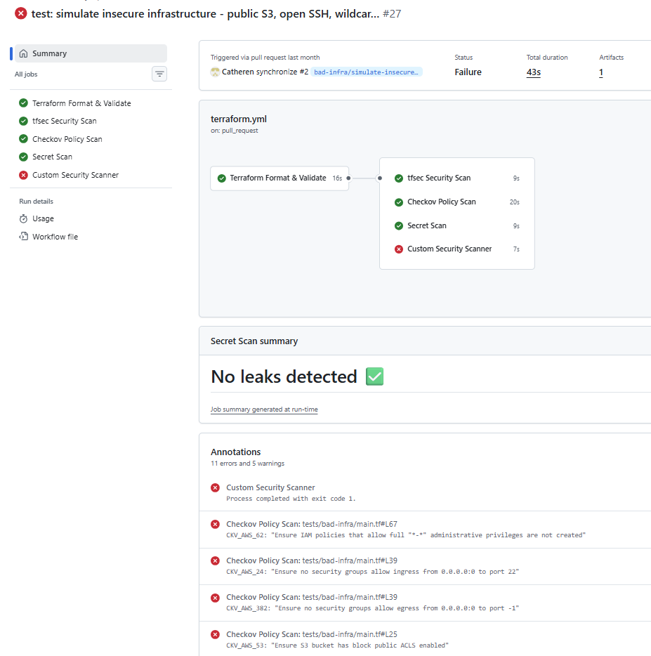

# Terraform Security Lab

[](https://www.terraform.io/)
[](https://github.com/features/actions)
[](https://www.checkov.io/)
[](https://aquasecurity.github.io/tfsec/)
[](https://github.com/gitleaks/gitleaks)
[](https://www.python.org/)
[](https://registry.terraform.io/providers/hashicorp/aws/latest)
[](LICENSE)

A production-style infrastructure security engineering project demonstrating how to build and enforce a security gate on every pull request — before insecure code ever reaches AWS.

Every PR is automatically scanned for infrastructure misconfigurations, compliance violations, committed secrets, and organization-specific policy violations. **A deliberately insecure PR was submitted to prove the pipeline catches real attacks — and it did.**

---

## What this demonstrates

| Skill | Implementation |
|---|---|
| Infrastructure as Code | Modular Terraform with secure-by-default AWS resources |
| CI/CD security pipeline | 5-job GitHub Actions workflow blocking on security failures |
| IaC misconfiguration scanning | tfsec + Checkov (CIS, SOC2, PCI-DSS benchmarks) |
| Secret detection | Gitleaks scanning full git history on every PR |
| Custom policy tooling | Python scanner enforcing 5 org-specific rules |
| Compliance documentation | SECURITY.md with findings and accepted risk justification |
| Adversarial testing | Bad PR simulation — 3 real vulnerabilities caught and blocked |

---

## Project structure

```
.
├── .github/
│   └── workflows/
│       └── terraform.yml       # 5-job security pipeline
├── modules/
│   ├── vpc/                    # Network topology — public IP disabled, default SG locked down
│   ├── ec2/                    # Compute — IMDSv2 enforced, EBS encrypted
│   ├── iam/                    # Roles — least-privilege, no wildcard actions
│   ├── s3/                     # Storage — encryption, versioning, public access blocked
│   └── logging/                # CloudTrail — log file validation, lifecycle policy
├── scanner/
│   └── scanner.py              # Custom Python security scanner
├── tests/
│   └── bad-infra/
│       └── main.tf             # Intentionally insecure Terraform (pipeline proof)
├── main.tf
├── variables.tf
├── outputs.tf
├── provider.tf
└── SECURITY.md
```

---

## CI/CD security pipeline

Triggered on every push and pull request. Each job runs independently — a failure in one does not suppress results from others.

```
Pull Request opened
        │
        ▼
┌─────────────────────────┐
│  terraform fmt + validate│  Syntax and formatting gate
└────────────┬────────────┘
             │
    ┌────────┴──────────────────────────┐
    ▼          ▼            ▼           ▼
┌────────┐ ┌────────┐ ┌─────────┐ ┌──────────────┐
│ tfsec  │ │Checkov │ │Gitleaks │ │Custom Scanner│
│IaC     │ │CIS/SOC2│ │Secret   │ │Org policy    │
│security│ │PCI-DSS │ │scanning │ │enforcement   │
└────────┘ └────────┘ └─────────┘ └──────────────┘
                     │
              All must pass
                     │
              PR can merge
```

| Job | Tool | Blocks merge? | What it catches |
|---|---|---|---|
| Format & Validate | terraform fmt/validate | Yes | Syntax errors, formatting drift |
| IaC Security Scan | tfsec | Yes | Infrastructure misconfigurations |
| Policy Scan | Checkov | Soft fail (documented exceptions) | CIS, SOC2, PCI-DSS violations |
| Secret Scan | Gitleaks | Yes | Credentials committed to git history |
| Custom Scanner | scanner.py | Yes (CRITICAL/HIGH) | Org-specific policy violations |

---

## Custom Python security scanner

`scanner/scanner.py` enforces organization-specific policies that generic tools don't know about. It runs as a standalone CLI in the pipeline and exits with code 1 on CRITICAL or HIGH findings, blocking the PR automatically.

### Rules enforced

| Rule | Severity | Policy |
|---|---|---|
| TAG-001 | HIGH | All resources must have: Environment, Owner, Project, DataClassification |
| NAME-001 | MEDIUM | Resources must follow naming convention: `{project}-{env}-{purpose}` |
| RGN-001 | HIGH | Deployments only permitted in us-east-1 and us-west-2 |
| ACCT-001 | CRITICAL | No hardcoded AWS account IDs — use `var.aws_account_id` |
| S3-001 | MEDIUM | All S3 buckets must have `aws_s3_bucket_logging` configured |

```bash
# Run locally
python scanner/scanner.py --path .
python scanner/scanner.py --path . --fail-on-findings
```

---

## Bad PR simulation — pipeline proof

To validate the pipeline catches real attacks (not just theoretical ones), a deliberately insecure Terraform file was introduced as a pull request on the `bad-infra/simulate-insecure-pr` branch. Three vulnerabilities were simulated:

- **Public S3 bucket** — all `block_public_*` controls set to false, exposing stored data to the internet
- **Unrestricted SSH** — security group allowing inbound port 22 from `0.0.0.0/0`
- **Wildcard IAM policy** — `Action: ["*"]` on `Resource: "*"`, effectively granting root-level AWS access

**The Checkov scan detected all three and blocked the PR from merging.**

| Finding | Rule | Vulnerability |
|---|---|---|
| CKV_AWS_53/54/55/56 | S3 public access | Public S3 bucket |
| CKV_AWS_24 | Unrestricted SSH | Open port 22 to 0.0.0.0/0 |
| CKV_AWS_62 | Wildcard IAM | Full account permissions |

The bad PR remains open on this repository as permanent evidence of the pipeline working as intended. See the [open pull request](../../pulls) to review the findings output.



---

## AWS modules — security controls

| Control | Resource | Implementation |
|---|---|---|
| IMDSv2 enforced | EC2 | `http_tokens = required` |
| EBS encryption | EC2 | `root_block_device encrypted = true` |
| Detailed monitoring | EC2 | `monitoring = true` |
| Public access blocked | S3 | `block_public_* = true` |
| Log file validation | CloudTrail | `enable_log_file_validation = true` |
| Log retention policy | S3/CloudTrail | Lifecycle: 90d → STANDARD_IA, 365d → expire |
| Default SG lockdown | VPC | `aws_default_security_group`, no rules |
| Public IP disabled | VPC subnet | `map_public_ip_on_launch = false` |

Accepted risks and their justifications are documented in [SECURITY.md](SECURITY.md).

---

## Getting started

### Prerequisites

- [Terraform](https://developer.hashicorp.com/terraform/install) >= 1.0
- Python 3.12
- [Checkov](https://www.checkov.io/2.Basics/Installing%20Checkov.html) *(optional — for local scans)*

### Run security checks locally

```bash
# Terraform
terraform init -backend=false
terraform fmt -check -recursive
terraform validate

# Custom scanner
python scanner/scanner.py --path .
python scanner/scanner.py --path . --fail-on-findings

# Checkov
checkov -d . --framework terraform
```

---

## Technologies

| Tool | Purpose |
|---|---|
| [Terraform](https://www.terraform.io/) ≥ 1.0 | Infrastructure as Code |
| [GitHub Actions](https://github.com/features/actions) | CI/CD orchestration |
| [tfsec](https://aquasecurity.github.io/tfsec/) | Terraform security scanning |
| [Checkov](https://www.checkov.io/) | IaC compliance policy scanning |
| [Gitleaks](https://github.com/gitleaks/gitleaks) | Secret detection in git history |
| Python 3.12 | Custom security scanner |
| AWS Provider | AWS resource definitions |

---

## License

[MIT License](LICENSE)
